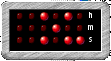



## Desktop Binary Clock \- way geeky\!

### Description

A binary clock! on your desktop! remembers where you put it and stays on top! best of all, it's different!!!
 
### More Info
 

             |
---                |---
**Submitted On**   |2004-07-14 05:23:02
**By**             |[Fosters](https://github.com/Planet-Source-Code/PSCIndex/blob/master/ByAuthor/fosters.md)
**Level**          |Intermediate
**User Rating**    |4.7 (14 globes from 3 users)
**Compatibility**  |VB 6\.0
**Category**       |[Complete Applications](https://github.com/Planet-Source-Code/PSCIndex/blob/master/ByCategory/complete-applications__1-27.md)
**World**          |[Visual Basic](https://github.com/Planet-Source-Code/PSCIndex/blob/master/ByWorld/visual-basic.md)
**Archive File**   |[Desktop\_Bi1769607142004\.zip](https://github.com/Planet-Source-Code/fosters-desktop-binary-clock-way-geeky__1-54938/archive/master.zip)

